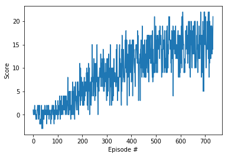

# Report
## The Learning algorithm
> A DQN agent/algorithm was chosen to solve Banana environment with following the implementation details: 

+ A simple (non-Prioritized) replay memory was used with a size of 1,00,000
+ Target soft updates were used

## Model
Following structure was used for agent:

+ Feature layer: Linear ReLu (37, 64)
+ First hidden layer: ReLu (64, 64)
+ Second hidden layer: Relu (64, 4)

## Hyperparameters
+ Learning rate (lrate): 0.0001
+ Discount factor (gamma): 0.99
+ Target network update frequency (target_update_frequency): 1000
+ Policy network update frequency (update_frequency): 4
+ Replay memory capacity (buffer_size): 100000
+ Batch size (batch_size): 64

## Performance
> Agent achieves average score **15.0**(a slightly larger than what Udacity required) over 100 episodes at 633 episode. 
At this moment, training could be stopped, task finished.
However, the learning continued and "stable point" was achieved at 733 episode. 
The mean score from that moment to end is 15.02.

## Result 

## Comments
During solving this problem, the biggest challenge was to set the learning rate & update frequency.
A small learning rate gave more stable training process, same was observed with update frequency of models. 
Too small was destabilizing training. 

## Future ideas
> I believe the results could be further improved using:
+ Prioritized Replay Memory 
+ Distributed Prioritized Experience Replay 
+ n-step DQN
